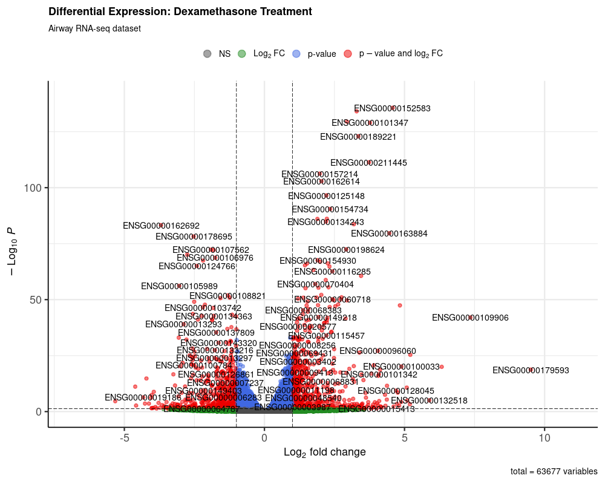

# RNA-seq Differential Expression Analysis  
## Dexamethasone Response in Human Airway Smooth Muscle Cells

<p align="center">
  
</p>

<p align="center">
  <em>Volcano plot highlighting genes significantly regulated by dexamethasone treatment.</em>
</p>

---

## Author

**Mariano Santoro**

---

## Overview

This project presents a reproducible RNA-seq differential gene expression (DGE) analysis of human airway smooth muscle cells treated with dexamethasone.

The analysis is based on the **Bioconductor airway dataset** and implemented using a structured pipeline combining **R** and **Bash scripting**.

---

## Tools & Technologies

- R (≥ 4.5)
- Bioconductor
- DESeq2
- ggplot2
- enrichR
- Bash

---

## Biological Question

How does dexamethasone treatment affect gene expression in human airway smooth muscle cells?

---

## Dataset

- Source: Bioconductor `airway`
- Type: RNA-seq count data
- Design: Paired samples (treated vs untreated)

---

## Workflow

1. **Environment check**  
   Validate R version and installed packages.

2. **Dataset loading**  
   Import and inspect RNA-seq count data.

3. **Differential expression analysis**  
   Fit DESeq2 model:

   ```r
   design = ~ cell + dex

4. **Quality control**
 - PCA plot
 - MA plot
 - Dispersion plot
 - Sample distance heatmap

5. **Gene-level analysis**
 - Identify significantly upregulated and downregulated genes
6. **Functional enrichment**
 - Gene Ontology (GO)
 - KEGG pathways
7. **Visualization**
 - Volcano plots
 - Heatmaps
 - Enrichment barplots

## Key Results
Identification of dexamethasone-responsive genes
Clear separation of treated vs control samples in PCA
Enriched biological pathways linked to immune and inflammatory responses

## How to Run

Clone the repository:

``git clone git@github.com:MSantoro87/airway-rnaseq-dge.git``
``cd airway-rnaseq-dge``

Run the pipeline:

``chmod +x scripts/run_pipeline.sh
./scripts/run_pipeline.sh``

Project Structure

.
├── environment/          # R environment and package setup
├── results/
│   ├── figures/         # Generated plots
│   └── tables/          # Output data tables
├── scripts/             # R scripts and Bash pipeline runner
│   └── run_pipeline.sh
├── README.md
└── .gitignore

## Reproducibility

The entire analysis is reproducible via the provided pipeline script.
All figures and tables can be regenerated from raw data using the scripts in the scripts/ directory.

## Future Work
- Add automated report generation (R Markdown / Quarto)
- Containerization (Docker)
- Workflow management (Snakemake or Nextflow)
- Extend analysis to Machine Learning modeling
