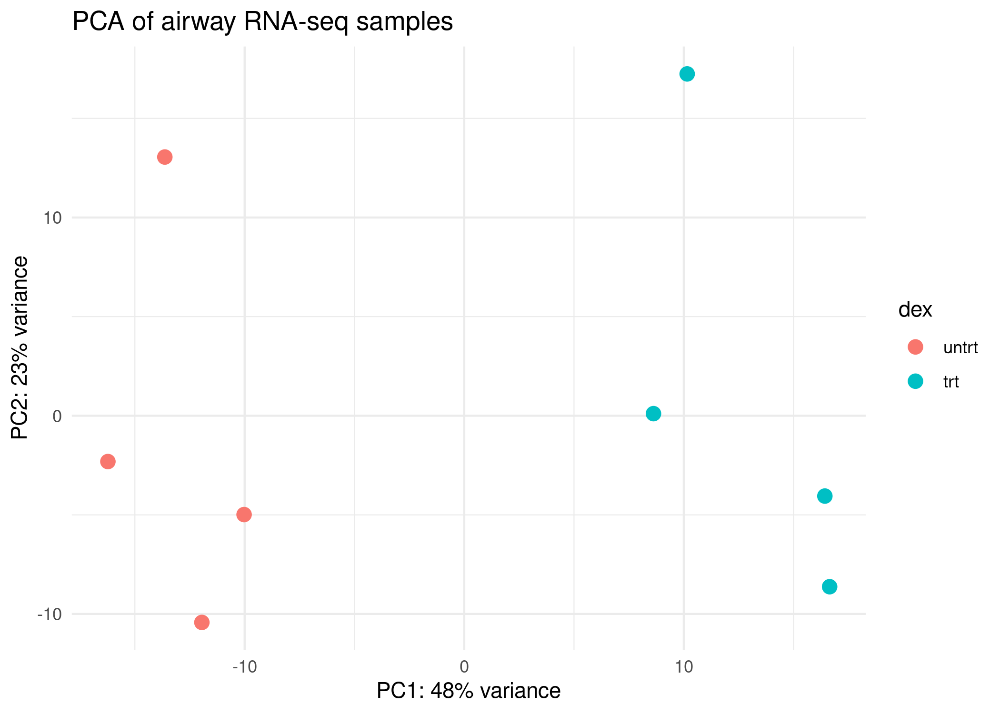

# RNA-seq Differential Expression Analysis  
## Dexamethasone Response in Human Airway Smooth Muscle Cells  

**Authored by Dr. Mariano Santoro**

<p align="center">
  
</p>

<p align="center">
  <em>Volcano plot highlighting genes significantly regulated by dexamethasone treatment.</em>
</p>

<p align="center">
  
</p>

<p align="center">
  <em>PCA showing separation between treated and control samples.</em>
</p>

---

## Overview

This project presents a **reproducible RNA-seq differential gene expression (DGE) analysis** of human airway smooth muscle cells treated with dexamethasone.

The analysis is based on the **Bioconductor airway dataset** and implemented using a structured pipeline combining:

- R for statistical analysis
- Bash scripting for workflow automation
- Configuration-driven parameters (`config.yaml`)
- Quarto for automated reporting

Future extensions will include **Machine Learning-based modeling approaches**.

---

## Why this project?

This repository demonstrates a **complete and reproducible bioinformatics workflow**, including:

- differential expression analysis with DESeq2
- functional enrichment analysis using GO and KEGG
- structured visualization outputs
- automated reporting
- modular and scalable pipeline design

It is intended both for **research reproducibility** and **portfolio demonstration of best practices**.

---

## Biological Question

How does dexamethasone treatment affect gene expression in human airway smooth muscle cells?

---

## Dataset

- Source: Bioconductor `airway`
- Type: RNA-seq count data
- Design: Paired samples, treated vs untreated

---

## Full Analysis Report

The main output of this project is the Quarto HTML report:

```text
reports/airway_rnaseq_report.html
```

The report includes:

- differential expression results
- PCA and volcano plots
- top gene heatmap
- functional enrichment analysis
- summary tables and interpretation


## Tools & Technologies
- R >= 4.5
- Bioconductor
- DESeq2
- ggplot2
- enrichR
- pheatmap
- yaml
- Bash
- Quarto

---

## Workflow

The analysis is implemented as modular pipeline:

```text
scripts/
├── 00_check_environment.R
├── 01_download_dataset.R
├── 02_deseq2_analysis.R
├── 03_enrichment_analysis.R
├── 04_interpretation_visualizations.R
├── 05_up_down_enrichment.R
└── run_pipeline.sh
```

### Pipeline steps

1. Environment check
- Validate R version and required packages

2. Dataset loading
- Import and inspect RNA-seq count data

3. Differential expression analysis
- Fit the DESeq2 model:

```text
design = ~ cell + dex
```

4. Quality control
- Generate PCA plots, MA plots, dispersion estimates, and sample distance heatmaps.

5. Gene-level analysis
- Identify significantly upregulated and downregulated genes.

6. Functional enrichment
- Perform Gene Ontology and KEGG pathway enrichment analysis.

7. Visualization
- Generate volcano plots, heatmaps, and enrichment plots.

---

## Key Results
- Identification of dexamethasone-responsive genes
- Clear separation of treated vs control samples in PCA
- Enrichment of biological pathways related to immune and inflammatory responses

---

## How to Run

Clone the repository:

``git clone git@github.com:MSantoro87/airway-rnaseq-dge.git``
``cd airway-rnaseq-dge``

Run the full pipeline:

``chmod +x scripts/run_pipeline.sh
./scripts/run_pipeline.sh``

---

## Project Structure

```text
airway-rnaseq-dge/
├── config/
│   └── config.yaml              # Analysis parameters
│
├── scripts/                     # Pipeline (00–05)
│   ├── 00_check_environment.R
│   ├── 01_download_dataset.R
│   ├── 02_deseq2_analysis.R
│   ├── 03_enrichment_analysis.R
│   ├── 04_interpretation_visualizations.R
│   ├── 05_up_down_enrichment.R
│   └── run_pipeline.sh
│
├── data/
│   └── processed/               # Intermediate R objects
│
├── results/
│   ├── tables/                 # Output tables (DE + enrichment)
│   └── figures/
│       ├── png/                # Preview figures
│       └── pdf/                # Publication-quality figures
│
├── reports/                     # Quarto analysis report
│   ├── airway_rnaseq_report.qmd
│   └── airway_rnaseq_report.html
│
├── environment/                # R session info
└── README.md
```

---

## Configuration

Analysis parameters are defined in:

```text
config/config.yaml
```

---

## Outputs

Generated result tables are stored in:

```text
results/tables/
```

These include:

- DESeq2 results
- significant gene lists
- GO enrichment results
- KEGG enrichment results

Generated figures are stored in:

```text
results/figures/png/
results/figures/pdf/
```
---

## Reproducibility

All results can be regenerated from the repository root with:

```text
./scripts/run_pipeline.sh
quarto render reports/airway_rnaseq_report.qmd
```

This recreates:

- processed data
- differential expression results
- enrichment analysis
- all figures
- the full HTML report

---

## Future Work
- Extend the project with Machine Learning-based modeling
- Add Docker-based containerization
- Add workflow orchestration with Snakemake or Nextflow
- Deploy the Quarto report with GitHub Pages
