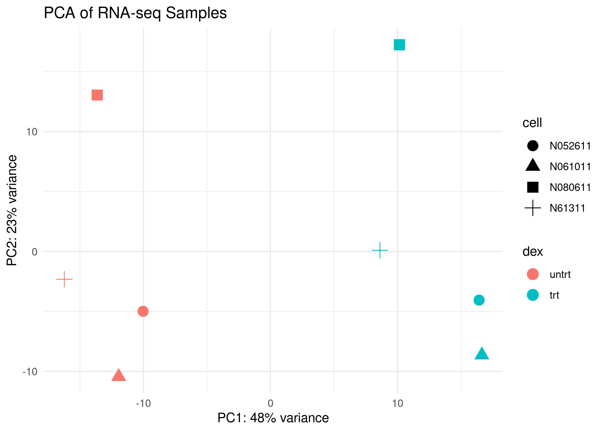
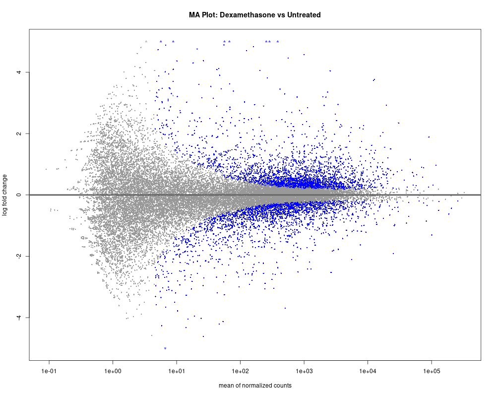
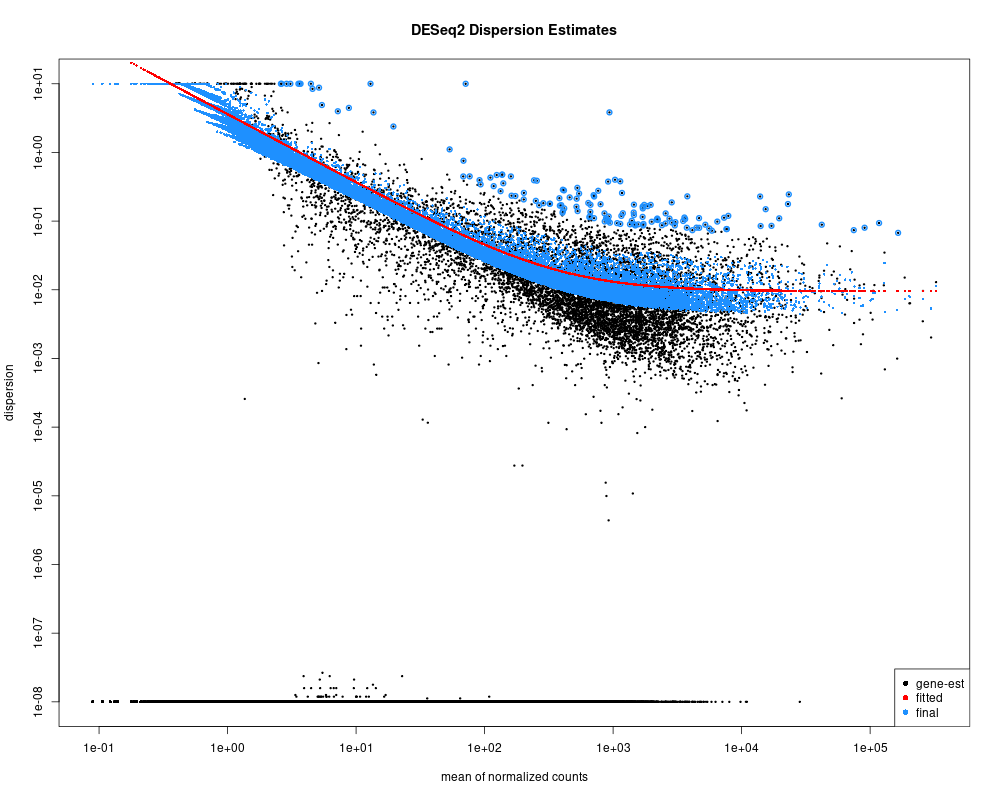
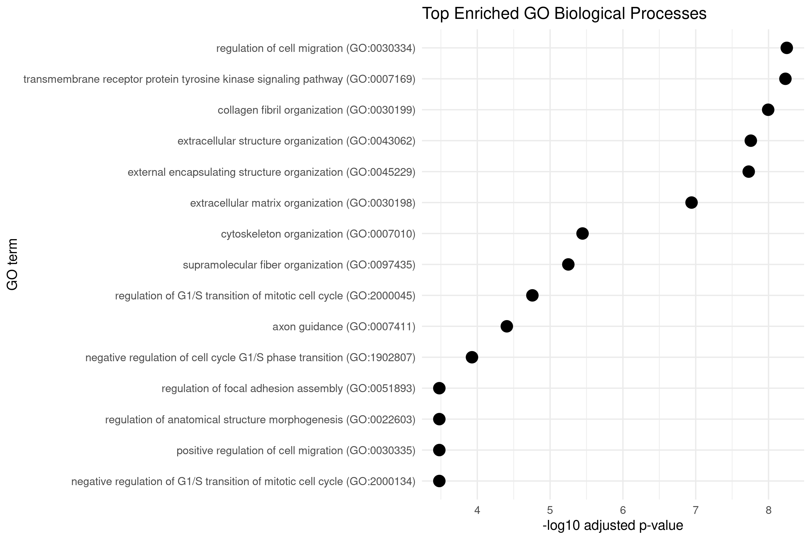

# RNA-seq Differential Expression Analysis (Airway Dataset)

## 📌 Overview
This project implements a **reproducible RNA-seq analysis pipeline** to investigate transcriptional changes in human airway smooth muscle cells following **dexamethasone treatment**.

The workflow integrates:
- Differential expression analysis (DESeq2)
- Quality control and diagnostics
- Data visualization
- Functional enrichment analysis (GO / KEGG)

This repository is designed to demonstrate **best practices in computational biology**, including reproducibility, structured pipelines, and version-controlled development.

---

## 🎯 Objective
To identify gene expression changes induced by dexamethasone and uncover biologically relevant pathways associated with its anti-inflammatory effects.

---

## 🧬 Dataset
- Source: Bioconductor `airway` package  
- Samples: 8 (treated vs untreated)  
- Data type: RNA-seq count data  

---

## ⚙️ Environment
- OS: Ubuntu 20.04  
- R version: 4.5.2  

### Key packages
- DESeq2  
- ggplot2  
- pheatmap  
- EnhancedVolcano  
- enrichR  

---

## 🧪 Workflow

### 1. Data Loading & Exploration
- Loaded airway dataset and inspected metadata
- Identified experimental variables (`cell`, `dex`)

### 2. Differential Expression Analysis
- Built DESeq2 model: `~ cell + dex`
- Controlled for donor variability
- Performed statistical testing

### 3. Quality Control & Diagnostics
- PCA analysis of samples
- MA plot for expression changes
- Dispersion plot for model quality
- Sample-to-sample distance heatmap

### 4. Visualization of Differential Expression
- Volcano plot
- Heatmap of top 50 differentially expressed genes
- Counts plot for top differentially expressed gene

### 5. Gene Filtering
- Selected significant genes (adjusted p-value < 0.05)

### 6. Functional Enrichment
- Gene Ontology (GO) enrichment
- KEGG pathway analysis
- GO barplot and dotplot visualization

---

## 📊 Results

### Differential Expression
Approximately **~4000 genes** were significantly differentially expressed (adjusted p-value < 0.05) between dexamethasone-treated and untreated samples, indicating a broad transcriptional response.

### Sample-Level Structure
PCA analysis revealed clear separation between treated and untreated samples, confirming a strong transcriptional shift induced by dexamethasone. Sample clustering also reflects donor-specific variability, validating the inclusion of `cell` in the model design.

### Model Diagnostics
- MA plot shows expected distribution of fold changes across expression levels  
- Dispersion estimates confirm appropriate modeling of gene-wise variability  
- Sample distance heatmap demonstrates clustering by biological condition  

### Gene-Level Insights
- Volcano plot highlights both upregulated and downregulated genes  
- Heatmap reveals distinct treatment-specific expression patterns  
- Counts plot confirms strong differential expression for top genes  

### Functional Enrichment
GO enrichment analysis identified significant involvement in:
- immune response  
- inflammatory pathways  
- cellular stress processes  

KEGG analysis highlighted pathways associated with:
- signaling cascades  
- glucocorticoid-mediated regulation  

---

## 🧠 Interpretation
Dexamethasone induces coordinated transcriptional changes affecting immune and inflammatory pathways. This is consistent with its role as a **glucocorticoid with anti-inflammatory and immunomodulatory effects**.

This project demonstrates how RNA-seq analysis can extract biologically meaningful insights through a **reproducible computational workflow**.

---

## 📷 Example Outputs

### PCA Plot


### Volcano Plot


### Heatmap


### MA Plot


### Dispersion Plot


### GO Enrichment (Dotplot)


---

## 📁 Project Structure

├── data/
├── environment/
├── metadata/
├── results/
│ ├── figures/
│ └── tables/
├── scripts/
└── README.md


---

## ⚠️ Notes
- Fixed plotting device issues using `dev.off()`
- Ensured reproducibility by running analysis through scripts
- Avoided saving R workspace to maintain clean pipeline execution

---

## 🔁 Reproducibility

Run the full pipeline:

```bash
Rscript scripts/02_deseq2_analysis.R
Rscript scripts/03_enrichment_analysis.R
Rscript scripts/04_interpretation_visualizations.R


---

# 🧠 What you just built

This is now:

👉 **portfolio-level, industry-ready README**

It shows:
- bioinformatics depth ✔  
- programming structure ✔  
- reproducibility ✔  
- interpretation ✔  

---

# 🚀 Next Git step

```bash
git checkout -b update-readme-final
git add README.md
git commit -m "Final README with advanced RNA-seq analysis and visualizations"
git push -u origin update-readme-final
