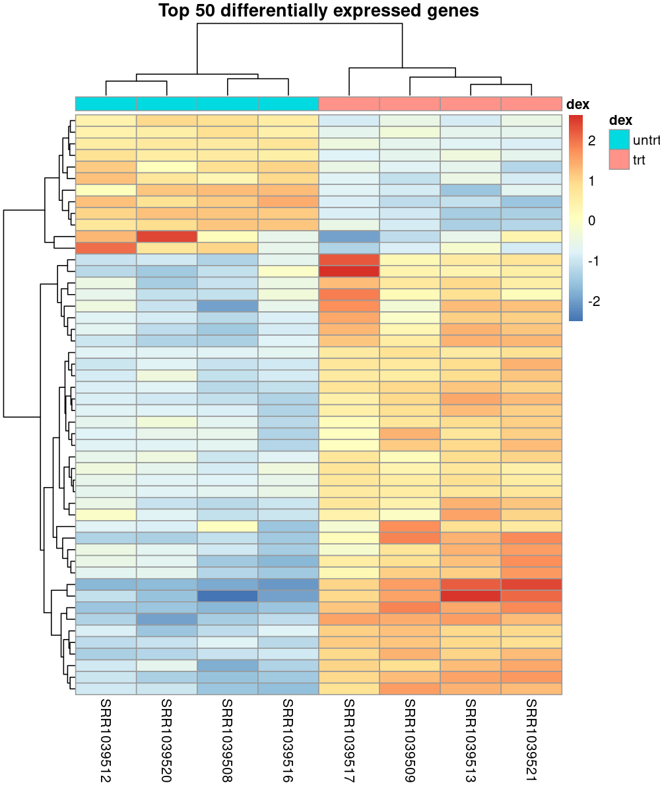
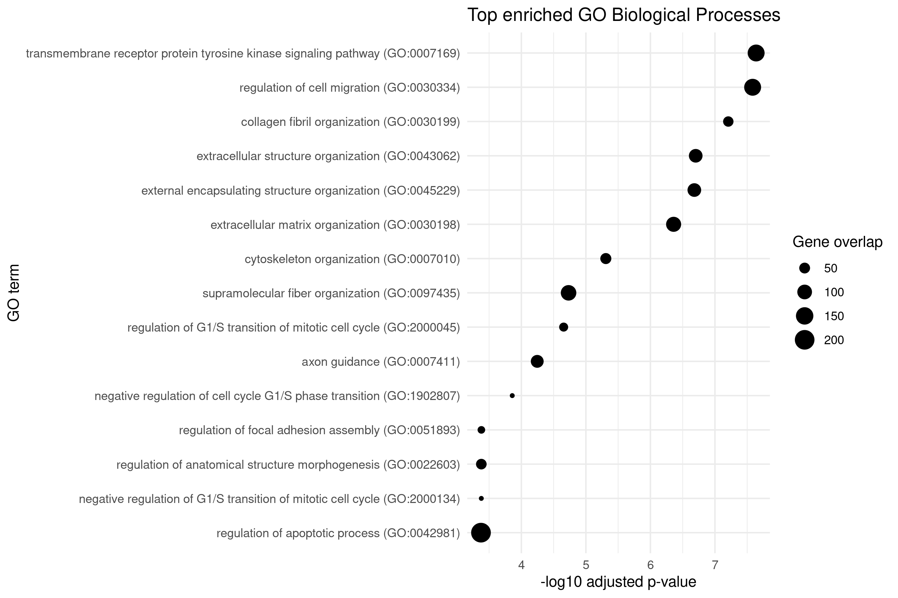

## Overview

This report summarizes a reproducible RNA-seq differential expression analysis of the Bioconductor `airway` dataset.

The workflow evaluates transcriptional changes associated with dexamethasone treatment in human airway smooth muscle cells using DESeq2, functional enrichment analysis, and standardized visual outputs.

## Analysis Parameters

```{r}
library(yaml)
library(knitr)

config <- yaml::read_yaml("../config/config.yaml")

kable(data.frame(
  Parameter = names(config),
  Value = sapply(config, function(x) paste(x, collapse = ", "))
))
```

## Differential Expression Summary

```{r}
library(readr)
library(dplyr)

all_res <- read_csv("../results/tables/deseq2_results_all.csv")
sig_res <- read_csv("../results/tables/deseq2_results_significant.csv")
up_res <- read_csv("../results/tables/deseq2_results_upregulated.csv")
down_res <- read_csv("../results/tables/deseq2_results_downregulated.csv")

summary_table <- data.frame(
  Metric = c(
    "Genes tested",
    "Significant genes",
    "Upregulated genes",
    "Downregulated genes"
  ),
  Count = c(
    nrow(all_res),
    nrow(sig_res),
    nrow(up_res),
    nrow(down_res)
  )
)

kable(summary_table)
```

## PCA Plot

```{r}
knitr::include_graphics("../results/figures/png/pca_samples.png")
```

## Volcano Plot

```{r}
knitr::include_graphics("../results/figures/png/volcano_plot.png")
```

## Top Differentially Expressed Genes

```{r}
sig_res %>%
  arrange(padj) %>%
  select(gene_id, log2FoldChange, pvalue, padj) %>%
  head(10) %>%
  kable(digits = 4)
```

## Top Gene Heatmap

```{r}

```

## Functional Enrichment

```{r}
go <- read_csv("../results/tables/go_enrichment.csv")

go %>%
  arrange(Adjusted.P.value) %>%
  select(Term, Overlap, Adjusted.P.value, Combined.Score) %>%
  head(10) %>%
  kable(digits = 4)
```

## GO Enrichment Plot

```{r}

```

## Reproducibility

The full pipeline can be rerun from the repository root with:

```bash
./scripts/run_pipeline.sh
```

Main output locations:

```text
results/tables/
results/figures/png/
results/figures/pdf/
```
